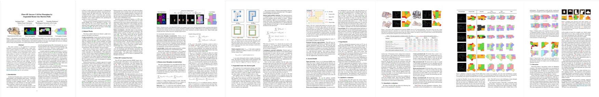

# Abstract

This paper proposes a new approach for automated floorplan reconstruction from RGBD scans, a major milestone in indoor mapping research. The approach, dubbed Floor-SP, formulates a novel optimization problem, where room-wise coordinate descent sequentially solves shortest path problems to optimize the floorplan graph structure. The objective function consists of data terms guided by deep neural networks, consistency terms encouraging adjacent rooms to share corners and walls, and the model complexity term. The approach does not require corner/edge primitive extraction unlike most other methods. We have evaluated our system on production-quality RGBD scans of 527 apartments or houses, including many units with non-Manhattan structures. Qualitative and quantitative evaluations demonstrate a significant performance boost over the current state-of-the-art. We also share our code and data.

# Paper

	

>

	<a href="assets/floor_sp.pdf"> Download PDF </a> &nbsp; &nbsp; <a href="https://arxiv.org/abs/1908.06702"> Arxiv </a> &nbsp; &nbsp; <a href="assets/floor_sp_supp.pdf"> Supplementary </a>

 

	<strong>@InProceedings{</strong>cjc2019floorsp,
	 
	&nbsp;&nbsp;&nbsp;&nbsp; title={Floor-SP: Inverse CAD for Floorplans by Sequential Room-wise Shortest Path}, 
	  
	&nbsp;&nbsp;&nbsp;&nbsp; author={Jiacheng Chen, Chen Liu, Jiaye Wu, Yasutaka Furukawa},
	  
	&nbsp;&nbsp;&nbsp;&nbsp; booktitle={The IEEE International Conference on Computer Vision (ICCV)},
	  
	&nbsp;&nbsp;&nbsp;&nbsp; year={2019} <strong>}</strong>

# Video

<iframe width="820" height="492" src="https://www.youtube.com/embed/PyYz7XAs7UE" frameborder="0" allow="accelerometer; autoplay; encrypted-media; gyroscope; picture-in-picture" allowfullscreen>
</iframe>

# Code / Data

Check our code on our [Github repo](https://github.com/woodfrog/floor-sp). The dataset will be released by Beike ([www.ke.com](https://www.ke.com)), and only the test set will be publicly available for now. The link will be provided soon.

# Acknowledgement

This research is partially supported by National Science Foundation under grant IIS 1618685, NSERC Discovery Grants, NSERC Discovery Grants Accelerator Supplements, and DND/NSERC Discovery Grant Supplement. We thank Beike ([www.ke.com](https://www.ke.com)) for the 3D house scans and annotations.
